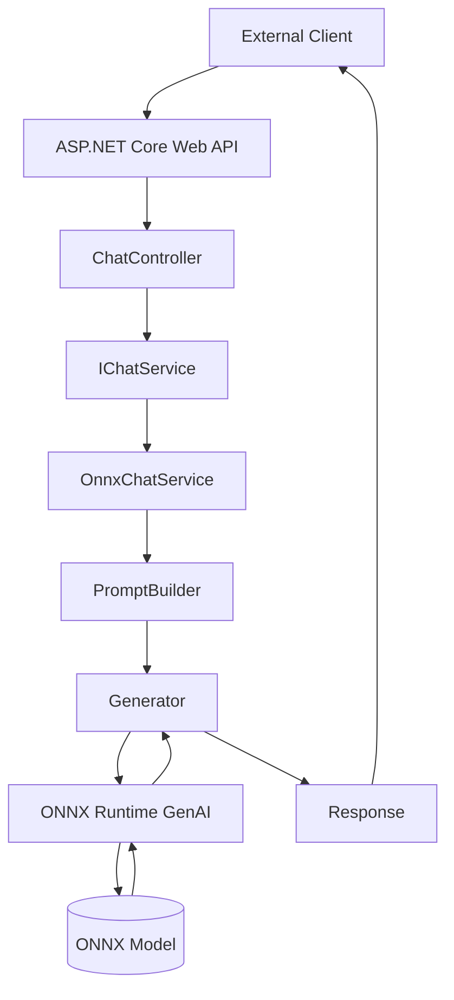

# Architecture

## High-Level Design

## Request Flow

1. Client submits message.
2. ChatController receives request.
3. Service prepends system message.
4. Prompt is tokenized.
5. ONNX Runtime GenAI generates output.
6. Response is returned to client.

## Service Lifetime

The model should be loaded once at application startup and reused for all requests.

Benefits:

- Faster responses
- Lower memory churn
- Reduced model initialization overhead
